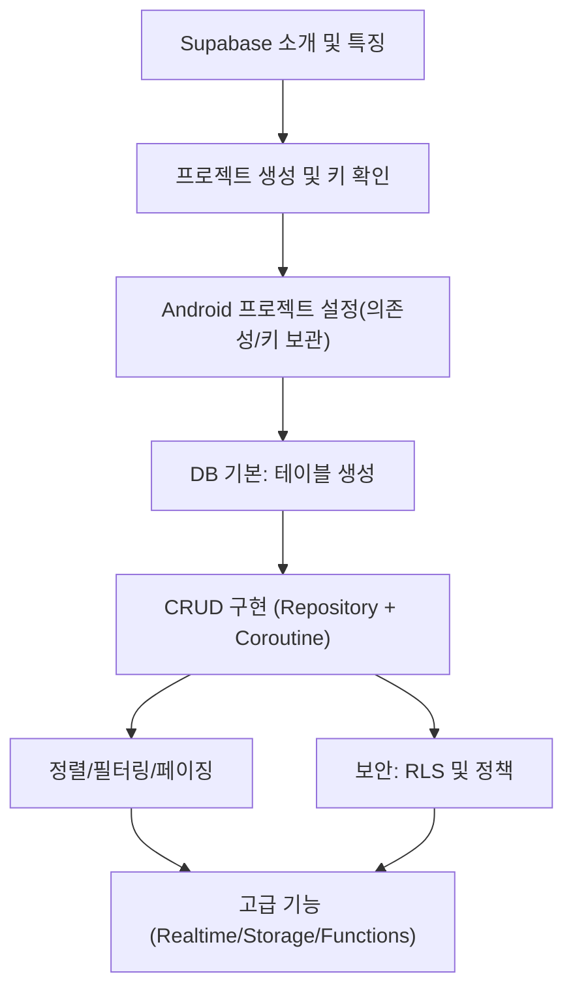

# Supabase 학습 노트

---

# 1. 개요

## 1.1 서론
슈퍼베이스(Supabase)는 개발자가 백엔드 서비스를 손쉽게 구축할 수 있도록 돕는 **Backend as a Service (BaaS)** 플랫폼입니다.

데이터베이스(PostgreSQL), 인증(Auth), 스토리지(Storage), 서버리스 함수(Edge Functions), 실시간(Realtime) 등의 기능을 제공하여 **안드로이드 앱에서 백엔드 개발 부담을 줄이고 빠르게 기능을 붙일 수 있게** 해줍니다.

특히 **PostgreSQL 기반 + 오픈소스**라는 점에서 Firebase와 차별화됩니다.

---

## 1.2 전체 구조



---

# 2. Supabase 소개 및 특징

## 2.1 Supabase란?
Supabase는 **BaaS** 플랫폼으로, 서버를 직접 운영하지 않고도 다음 기능을 사용할 수 있습니다.

### 주요 기능

| 기능 | Android에서의 사용 예 |
|---|---|
| Database (Postgres) | 앱 데이터 저장/조회(CRUD) |
| Authentication | 이메일/소셜 로그인, 세션 관리 |
| Storage | 이미지/동영상 업로드 및 URL 제공 |
| Edge Functions | 결제 검증, 서버 로직 처리 |
| Realtime | DB 변경 사항 실시간 반영(채팅 등) |

---

## 2.2 Supabase 장점

### 1️⃣ 오픈소스 기반
- 벤더 종속성 낮음
- 필요 시 자체 호스팅 가능

### 2️⃣ PostgreSQL 기반
- SQL 기반이라 데이터 모델링/조인/집계에 강함
- RLS(행 단위 보안)로 권한 제어 가능

### 3️⃣ 빠른 개발
- REST / SDK로 바로 사용 가능
- Android에서 Repository 패턴으로 쉽게 캡슐화 가능

---

# 3. 프로젝트 설정 및 연결 (Android)

## 3.1 Supabase 프로젝트 생성
1. https://supabase.com 접속
2. GitHub 로그인
3. New Project 생성

생성 후 확인해야 할 정보:

- **Project URL**
- **Anon Public API Key** (클라이언트 앱에서 사용)
- (중요) **Service Role Key**는 서버에서만 사용 (앱에 넣으면 안 됨)

---

## 3.2 Android 앱 연결

### 3.2.1 키 보관 방법 (권장)
앱에 키를 “하드코딩”하지 않도록 구성합니다.

- `local.properties` (로컬 개발용)
- 또는 CI에서 `gradle.properties` 주입
- 또는 buildConfigField로 BuildConfig 생성

#### 예: `local.properties`
```properties
SUPABASE_URL=https://xxxx.supabase.co
SUPABASE_ANON_KEY=your_anon_key
```

#### 예: app/build.gradle (Groovy)에서 BuildConfig로 주입
```gradle
android {
  defaultConfig {
    buildConfigField "String", "SUPABASE_URL", "\"${project.properties['SUPABASE_URL']}\""
    buildConfigField "String", "SUPABASE_ANON_KEY", "\"${project.properties['SUPABASE_ANON_KEY']}\""
  }
  buildFeatures {
    buildConfig true
  }
}
```

> ⚠️ **Service Role Key는 절대 Android 앱에 넣지 마세요.** (유출 시 DB 전체 권한)

---

### 3.2.2 Supabase 클라이언트 설치
Android에서는 보통 **Kotlin 라이브러리**를 사용합니다.

> 아래는 개념 예시입니다. 실제 버전/모듈명은 Supabase Kotlin SDK 문서 기준으로 맞추세요.

#### build.gradle.kts 예시(개념)
```kotlin
dependencies {
  implementation("io.github.jan-tennert.supabase:supabase-kt:...") // 예시
  implementation("io.ktor:ktor-client-okhttp:...")                // HTTP 엔진 예시
}
```

---

### 3.2.3 Supabase Client 생성 (싱글톤/DI)
#### 예: Kotlin 객체로 관리
```kotlin
object SupabaseClientProvider {
  val client = createSupabaseClient(
    supabaseUrl = BuildConfig.SUPABASE_URL,
    supabaseKey = BuildConfig.SUPABASE_ANON_KEY
  ) {
    // plugins: Auth, Postgrest, Realtime, Storage 등 필요 기능만 활성화
  }
}
```

> DI(Hilt/Koin)를 사용하면 테스트/모듈 분리에 더 유리합니다.

---

# 4. 데이터베이스 기본: 테이블 생성

## 4.1 테이블 생성
Supabase Dashboard → **Table Editor**

테이블 이름
```
smoothies
```

컬럼 구조 예시:

| 컬럼 | 타입 |
|---|---|
| id | integer (PK) |
| created_at | timestamp |
| title | text |
| method | text |
| rating | integer |

---

## 4.2 데이터 추가(샘플)
예시 데이터

| title | method | rating |
|---|---|---|
| Berry Blaster | Mix berries | 5 |
| Banana Booster | Blend banana | 7 |

---

# 5. CRUD 작업 (Android / Coroutines)

> Android에서는 보통 **Repository 패턴 + Coroutine + ViewModel** 조합으로 구현합니다.

## 5.1 데이터 모델
```kotlin
@kotlinx.serialization.Serializable
data class Smoothie(
  val id: Int? = null,
  val created_at: String? = null,
  val title: String? = null,
  val method: String? = null,
  val rating: Int? = null
)
```

---

## 5.2 Repository 예시

### Read (전체 조회)
```kotlin
class SmoothieRepository(
  private val supabase: Any /* 실제 타입으로 교체 */
) {
  suspend fun fetchSmoothies(): List<Smoothie> {
    // 예시: postgrest from("smoothies").select()
    TODO("Supabase Kotlin SDK 호출로 구현")
  }
}
```

> 실제 코드는 사용하는 Supabase Kotlin SDK의 Postgrest 호출 형태에 맞춰 작성하세요.

---

### Create (추가)
```kotlin
suspend fun createSmoothie(title: String, method: String, rating: Int) {
  // insert 호출
}
```

### Read Single (단건 조회)
```kotlin
suspend fun fetchSmoothie(id: Int): Smoothie {
  // eq("id", id).single() 호출
  TODO()
}
```

### Update (수정)
```kotlin
suspend fun updateSmoothie(id: Int, title: String, method: String, rating: Int) {
  // update + eq("id", id)
}
```

### Delete (삭제)
```kotlin
suspend fun deleteSmoothie(id: Int) {
  // delete + eq("id", id)
}
```

---

## 5.3 ViewModel 예시 (상태 관리)
```kotlin
class SmoothieViewModel(
  private val repo: SmoothieRepository
) : ViewModel() {

  private val _smoothies = MutableStateFlow<List<Smoothie>>(emptyList())
  val smoothies: StateFlow<List<Smoothie>> = _smoothies

  private val _error = MutableStateFlow<String?>(null)
  val error: StateFlow<String?> = _error

  fun load() {
    viewModelScope.launch {
      runCatching { repo.fetchSmoothies() }
        .onSuccess {
          _smoothies.value = it
          _error.value = null
        }
        .onFailure {
          _error.value = "Could not fetch smoothies"
        }
    }
  }
}
```

---

## 5.4 UI 예시 (Jetpack Compose)
```kotlin
@Composable
fun SmoothieScreen(vm: SmoothieViewModel) {
  val list by vm.smoothies.collectAsState()
  val error by vm.error.collectAsState()

  LaunchedEffect(Unit) { vm.load() }

  if (error != null) {
    Text(text = error ?: "")
  } else {
    LazyColumn {
      items(list) { smoothie ->
        Text(text = smoothie.title.orEmpty())
      }
    }
  }
}
```

> View 시스템이면 RecyclerView + LiveData/Flow로 치환하면 됩니다.

---

# 6. 데이터 정렬/필터링

## 6.1 정렬 (Order)
서버에서 정렬하는 방식이 일반적입니다.

- created_at desc
- rating desc
- title asc

```kotlin
suspend fun fetchSmoothiesOrderByRatingDesc(): List<Smoothie> {
  // select().order("rating", desc = true)
  TODO()
}
```

---

# 7. 보안 (RLS 및 정책)

## 7.1 RLS(Row Level Security)
RLS는 **행(row) 단위로 데이터 접근을 제어**하는 기능입니다.

활성화:
```
Table → Enable RLS
```

활성화하면 기본적으로 **모든 접근이 차단**됩니다.

---

## 7.2 정책(Policies) 생성

### SELECT 정책 예시 (모든 사용자 읽기 허용)
| 설정 | 값 |
|---|---|
| Policy Name | Allow read smoothies |
| Action | SELECT |
| Condition | true |

### INSERT 정책 예시 (모든 사용자 생성 허용)
| 설정 | 값 |
|---|---|
| Policy Name | Allow insert smoothies |
| Action | INSERT |
| Condition | true |

### UPDATE / DELETE
정책을 만들지 않으면 **차단**됩니다.  
일반적으로는 인증 사용자만 허용하거나, 작성자만 수정/삭제 가능하도록 설정합니다.

---

# 8. 고급 기능 (향후 학습)

| 기능 | Android에서의 활용 |
|---|---|
| Authentication | 로그인/세션 유지, 토큰 기반 접근 |
| Realtime | 채팅/댓글 실시간 갱신 |
| Storage | 이미지 업로드, 프로필 사진 |
| Edge Functions | 결제 검증, 보안 로직, 서버 계산 |

---

# 정리
Supabase는 Android 앱에서 다음을 빠르게 구현할 수 있게 해주는 BaaS입니다.

- PostgreSQL DB 기반 CRUD
- 인증(Auth) + RLS 보안
- 파일 업로드(Storage)
- 서버리스 함수(Edge Functions)
- 실시간 업데이트(Realtime)

Android에서는 보통 **Repository + Coroutine + ViewModel + (Compose/UI)** 패턴으로 통합하여 사용합니다.
